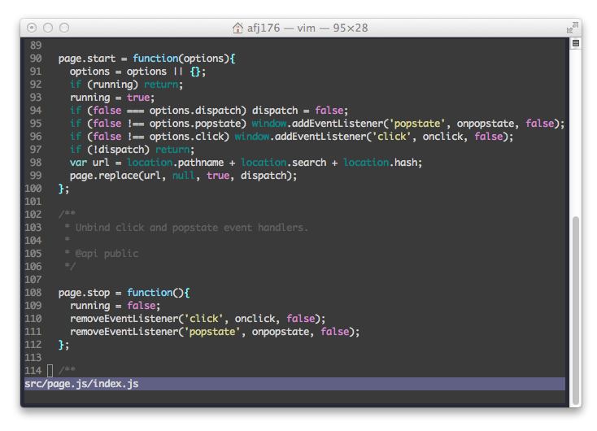

#Aethusa

***Daughter of Poseidon | Theme of bosses***

Vim Theme based on [Deep Blue See](https://github.com/jisaacks/DeepBlueSee/) by [JD Isaacks](https://github.com/jisaacks)

##Installing

Copy "Aethusa.vim" file to:

    ~/.vim/colors
    
Then open up your .vimrc and add

    colorscheme Aethusa

If you're a Textmate/Sublime User, see:

[Aethusa-tmTheme](https://github.com/afj176/Aethusa-tmTheme)

If you're a Atom.io User, see:

[Aethusa-atom](https://github.com/afj176/Aethusa-atom)